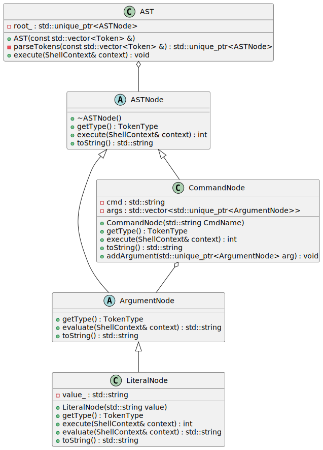
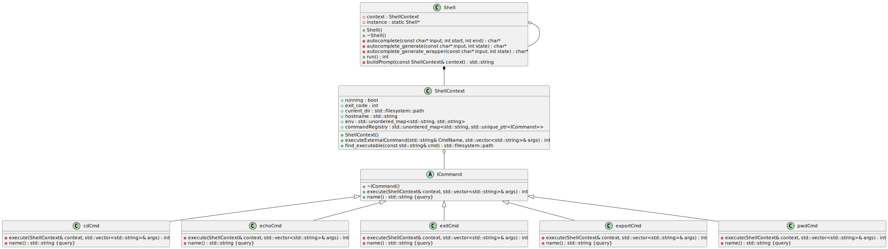

# dezsh

This is a toy shell implemented in C++23.

## Implementation details

Below, you can see the UML diagrams of the various parts of dezsh.

### Lexer 

There is nothing special about the lexer. It takes an input string, and returns a vector of Tokens.

### Abstract Syntax Tree

Being a rather simple implementation, it currently allows for running builtin and external commands with arguments. Before implementing piping operations I might explore parsing arithmetic operations, at least things like 1+1.

### Shell and ShellContext

The idea of the Shell class is wrap everything into one object containing the context and specifics. The REPL provided in `Shell::run()`, creates a line prompting the user for input, and uses readline to obtain it, with autocompletion enabled. The functions for the autocompletion are hidden as static private members in the class. 

At the core of the class lies the ShellContext struct. It stores teh current working directory, environment variables and most importantly a command registry, which keeps track of all the registered builtin commands.

